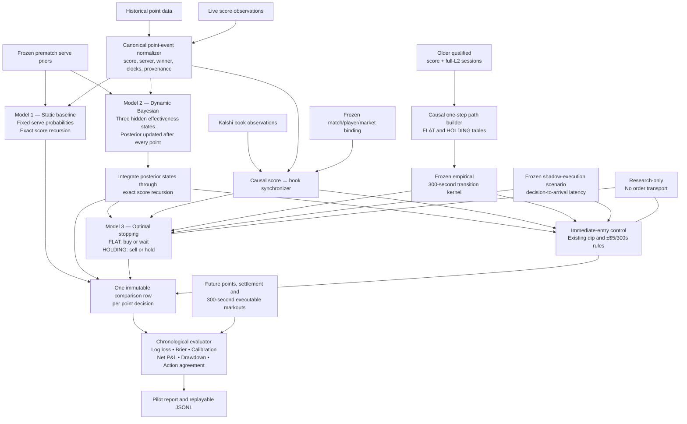

# Inci Three-Model Tennis Pilot Design

Date: 2026-08-04
Status: Approved for implementation planning
Authority: offline replay and read-only shadow research only

## 1. Purpose

Build a time-boxed pilot that evaluates three progressively stronger models on
the same causal point and Kalshi-book observations:

1. a static serve-strength baseline using Inci's exact tennis score recursion;
2. a point-updated three-state Bayesian effectiveness model using the same
   score recursion; and
3. a finite-horizon optimal-stopping policy that consumes Model 2, executable
   Kalshi book state, fees, depth, and a frozen empirical 300-second transition
   kernel.

The pilot measures whether additional state adaptation and waiting optionality
improve held-out forecasts and fee-inclusive shadow outcomes. It does not place
orders and does not claim profitability from a synthetic or undersupported
kernel.

## 2. Architecture



## 3. Shared causal event

Every model consumes the same immutable `PilotPointEvent`:

- canonical match identity;
- unique point identity and strictly increasing point sequence;
- complete trusted state before and after the point;
- server and point winner;
- consensus epoch and accepted score-transition digest;
- event, receipt, and monotonic clocks; and
- supporting independent source-lineage digests.

An event is ineligible when it is duplicated, corrected after consumption,
missing server or winner, spans more than one point, crosses consensus epochs,
or cannot be replayed legally from the prior state. Ineligible events are
persisted as abstentions and never silently approximated.

Historical imports may be tagged `historical_research`. Live observations
remain `unqualified_shadow` until they satisfy the existing provider and
consensus qualification path. Neither tag can authorize execution.

Model 3 and the immediate-entry control additionally require a
`PilotDecisionFrame` projected from the concrete
`ConsensusL2ResearchFrameV1`, `MatchBinding`, and `BindingMetadata`. The
projection rejects a non-atomic score change, wrong consensus epoch, stale
pair, mismatched match/contract/player orientation, or any book that is not
the frame's causally bound direct durable successor. A caller cannot attach an
arbitrary standalone book to a point event.

## 4. Model 1: static baseline

Model 1 receives frozen prematch home and away service-point probabilities.
It never changes them during the match. At each eligible score state it calls
`standard_bo3_live_probabilities` to produce current-set and match-win
probabilities. It also persists the home player's next-point probability from
the known next server and the two frozen service probabilities.

This is the control model. If a more complex model cannot beat it on untouched
chronological matches, the additional complexity is rejected.

## 5. Model 2: dynamic Bayesian effectiveness

Each player has three latent service-effectiveness states:

- `BELOW_BASELINE`;
- `BASELINE`; and
- `ABOVE_BASELINE`.

The state transition matrix is sticky but permits regime changes. Each state
adds a frozen offset to the player's prematch service log-odds. When a player
serves, the observed server-win/server-loss result updates only that player's
posterior by the hidden-Markov forward algorithm. The other player's posterior
is carried forward unchanged.

The match fair value is not calculated by inserting the posterior mean into
the tennis calculator. It integrates all nine home/away state pairs:

```text
sum(home_weight[i] * away_weight[j]
    * live_probability(score, home_p[i], away_p[j]))
```

This preserves uncertainty through the nonlinear point-to-game-to-set-to-match
recursion.

Model 2 also persists a posterior-weighted home next-point probability after
the current point update and before the next point is observed. That exact
field—not a reconstructed value—is used for next-point log loss and Brier
score.

The transition matrix, state offsets, starting weights, feature definitions,
and training cutoff are stored in a frozen artifact. No parameter is updated
from an evaluation match. Static and dynamic artifacts are target-match bound:
their cutoff is strictly before the target's scheduled start, their training
and validation match IDs are explicit and digest-bound, and the target match
is absent from those partitions. Fitting rejects an unpartitioned event rather
than silently filtering it out.

## 6. Model 3: finite-horizon optimal stopping

Model 3 is a shadow policy layered on Model 2. Its actions are:

```text
FLAT:     BUY or WAIT
HOLDING:  SELL or HOLD
```

Its state contains:

- Model 2's fair-value distribution;
- trusted score identity and server;
- executable Kalshi bid/ask ladders and available size;
- spread, depth, book sequence, and freshness;
- simulated position and allocated fees;
- frozen decision-to-arrival latency and execution-scenario identity;
- elapsed time and remaining time in the 300-second horizon; and
- a versioned empirical transition-kernel identity.

Each decision frame carries the separately bound HOME-YES and AWAY-YES books.
A BUY result identifies one exact authorized player/market route; the caller
cannot preattach a preferred book. Once filled, the position remains on that
route through liquidation.

The Bellman solver maximizes expected fee-inclusive executable liquidation
P&L, subject to the existing aggregate `$50.00` debit cap and risk exits. It
does not submit, reserve, or construct a Kalshi order.

Version 1 makes policy decisions only at an accepted point paired with its
first subsequent trustworthy L2 frame. `WAIT` means wait for the next eligible
paired point frame. A shadow `BUY` or `SELL` becomes pending and may execute
only against the first gap-free L2 observation at or after its frozen
decision-to-arrival delay; it never fills from the snapshot that caused the
decision. A missing arrival book, sequence gap, or inadequate depth produces a
typed no-fill/censor result. The 300-second holding clock begins at the actual
simulated fill time.

The empirical kernel contains separate one-step FLAT and HOLDING transition
tables. A FLAT transition advances the bounded wait clock and models delayed
entry/no-fill outcomes; a successful buy starts a fresh 300-second holding
clock. A HOLDING transition advances positive event time toward forced
liquidation. Terminal 300-second markouts alone are labels, not a Bellman
transition kernel.

If no qualified frozen transition kernel exists, Model 3 must return
`UNSUPPORTED_NO_MARKOUT_KERNEL`. A hand-selected, same-session, synthetic, or
future-aware kernel may exercise unit tests but may not produce a supported
pilot action.

The immediate-entry control receives the same decision frame, Model 2 output,
kernel, fee schedule, and delayed-execution scenario. It reuses the current
45-second/7-cent dip gate and executable `+$5 / -$5 / 300-second` exits but has
no `WAIT` action. Its shadow position and ledger are independent of Model 3.

## 7. Training and evaluation

All train, validation, and test partitions are chronological and grouped by
match. The future test partition remains untouched until Model 1, Model 2,
Model 3, thresholds, and artifact digests are frozen.

Model 1 and Model 2 are compared on:

- next-point log loss;
- next-point Brier score;
- match-probability log loss;
- calibration by frozen probability bins;
- model disagreement by score leverage; and
- abstention and data-loss rates.

Model 3 is compared with the existing immediate-entry threshold baseline on:

- supported action count;
- fill-adjusted and fee-inclusive 300-second net P&L;
- maximum drawdown and tail loss;
- buy-now versus wait value;
- sell-now versus hold value;
- no-fill and insufficient-depth frequency; and
- match-clustered uncertainty intervals.

One match or one live session is a plumbing pilot, not edge evidence.

## 8. Runtime and persistence

The initial pilot is a separate replay/analysis path. It does not alter the
sealed production-provider registry or the existing paper-policy promotion
gate.

Each accepted event writes one immutable canonical JSONL comparison record
containing:

- common input and provenance digests;
- Model 1 output;
- Model 2 belief and output;
- Model 3 support state, action, and value bounds;
- immediate-entry control action and support state;
- causally paired book identity; and
- code and frozen-artifact fingerprints.

Future point, settlement, and 300-second markout outcomes are written later as
separate append-only label records keyed by the comparison-record digest. The
original event record is never rewritten with future information.

Replay of the same inputs and artifacts must reproduce the same bytes.

## 9. Fail-closed behavior

All models abstain when:

- the score transition is not exactly one legal point;
- server, winner, player orientation, or match binding is ambiguous;
- a score correction or consensus-epoch change invalidates prior state;
- the book is stale, crossed, gapped, reconnected without recovery, or lacks
  executable depth;
- a required artifact digest is absent or mismatched; or
- future information would be required to calculate the current output.

An abstention is a valid pilot result. The runner must never weaken a gate to
increase action count.

## 10. Pilot acceptance criteria

The pilot is ready to run when:

1. all three model interfaces execute deterministically on the same replay;
2. Model 1 reproduces the existing exact-score calculator;
3. Model 2 updates after each atomic point and its posterior weights sum to one;
4. Model 3 remains unsupported without a frozen qualified markout kernel;
5. Model 3 can receive books only through the exact causal frame adapter;
6. the immediate-entry baseline uses an independent ledger but identical
   delayed execution evidence;
7. duplicate, correction, chronology, arrival-latency, and book-gap tests pass;
8. the runner imports no order-capable transport;
9. the report separates plumbing results from edge evidence; and
10. the existing legacy and focused adaptive suites remain unchanged.

## 11. Deliberate pilot limitations

- Score-only inputs cannot identify serve direction, speed, spin, return
  position, or shot choice.
- A three-state effectiveness model may detect a changing outcome regime but
  cannot label its cause as tactics, fatigue, injury, or luck.
- The current repository has no synchronized forward corpus sufficient to
  qualify Model 3.
- The first live run may therefore compare Models 1 and 2 while Model 3
  correctly returns unsupported and collects future training evidence.
- Version 1's policy cadence is point-triggered; it does not claim to optimize
  reactions to every intervening order-book update.
- No result from this pilot authorizes live or demo trading.
